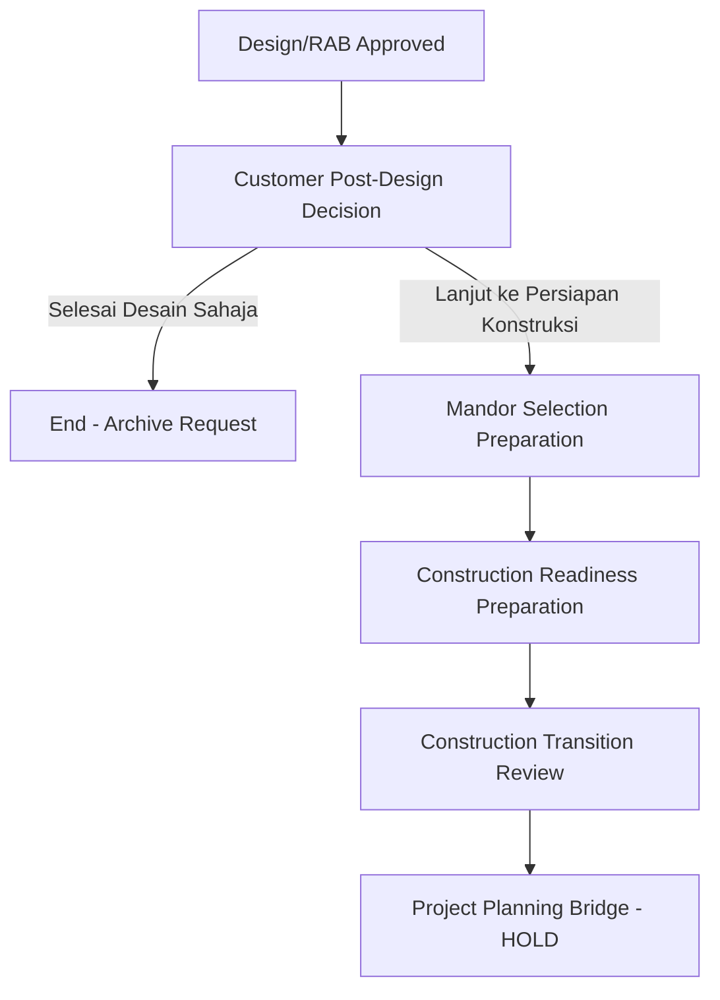

# Design to Construction Preparation Flow

Alur transisi dari tahap desain arsitektur menuju persiapan konstruksi lapangan dalam sistem RKK.

## Workflow Overview

## Detail Tahapan

### 1. Customer Post-Design Decision (Batch 10A)
Setelah Admin/Arsitek merilis desain final, Konsumen memberikan intensi melalui timeline.
- **Event**: `customer_post_design_decision`
- **Output**: Menentukan apakah Admin perlu melakukan persiapan konstruksi.

### 2. Mandor Selection Preparation (Batch 11A)
Admin melakukan screening awal terhadap database Mandor (Foreman) lokal.
- **Event**: `admin_mandor_selection_preparation`
- **Data**: Menampilkan kandidat dari API `/api/foreman`.
- **Note**: Ini bukan penugasan rill (`Project.foremanId`), melainkan shortlist administratif.

### 3. Construction Readiness Preparation (Batch 12A)
Admin melakukan verifikasi kesiapan teknis dan screening Pengawas (Supervisor).
- **Event**: `admin_construction_readiness_preparation`
- **Gate**: Hanya terbuka jika Konsumen memilih "Lanjut Konstruksi" DAN Mandor Shortlist sudah dibuat.
- **Data**: Menampilkan kandidat dari API `/api/supervisor`.

### 4. Construction Transition Review (Batch 14)
Marker review final oleh Admin untuk memastikan seluruh data persiapan sudah valid.
- **Event**: `admin_construction_transition_review`
- **Recommendation**: `project_planning_review_only` (Status marker untuk fase bridge berikutnya).

## Data Integrity
Seluruh flow di atas disimpan dalam tabel `DesignRequestHistory`. Tidak ada perubahan langsung pada tabel `Project` untuk menjaga pemisahan antara **Planning Intent** dan **Active Execution**.
