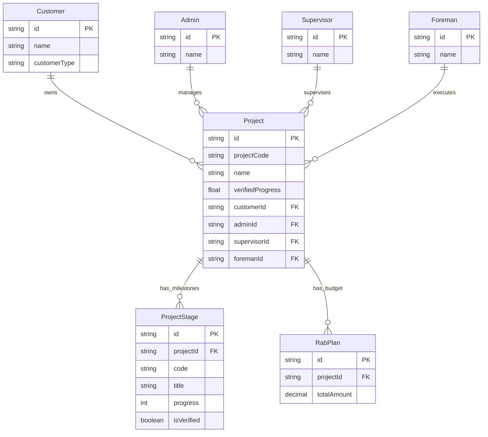

# Core Project ERD

Status: Draft / Generated from Prisma schema

## Tujuan
Menjelaskan relasi inti antara entitas pemilik proyek, pengelola, dan struktur dasar pengerjaan (Stages & RAB).

## Diagram

## Catatan Relasi
- Relasi antara Project dengan Admin, Supervisor, dan Foreman adalah relasi penugasan (*assignment*).
- **verifiedProgress** di level Project adalah rekapitulasi dari hasil verifikasi lapangan.
- **ProjectStage** merepresentasikan lini masa (timeline) pekerjaan yang dibagi per kategori atau minggu.
