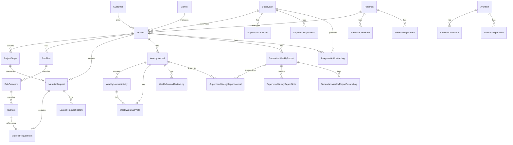

# Full Database Schema ERD

Status: Draft / Generated from Prisma schema

## Tujuan
Memberikan gambaran besar seluruh tabel yang ada dalam sistem RKK dan bagaimana mereka saling terhubung secara global.

## Diagram

## Catatan Relasi
- **Project** adalah pusat gravitasi data. Hampir semua modul operasional (RAB, Jurnal, Material, Laporan) terikat langsung ke Project.
- **Reference Fields vs Formal Relations**: Beberapa field seperti `verifiedProgressById`, `verifiedBy`, dan `reviewedById` disimpan sebagai **String ID (Reference Fields)** untuk keperluan audit dan snapshot, tanpa relasi foreign key formal di level Prisma Schema.
- **Superadmin** saat ini belum memiliki relasi langsung ke tabel operasional karena fungsinya adalah manajemen sistem global.
- **ProgressVerificationLog** adalah kunci dari audit progress resmi yang membedakan klaim mandor dengan fakta lapangan.
