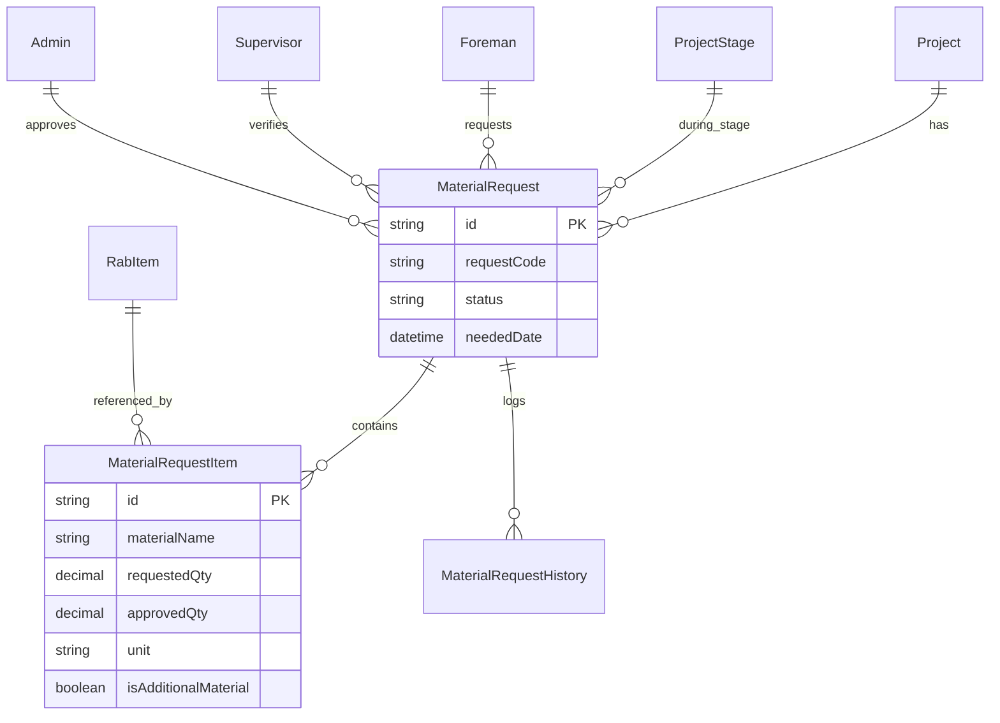

# Material Request ERD

Status: Draft / Generated from Prisma schema

## Tujuan
Menjelaskan relasi antar entitas yang terlibat dalam alur pengadaan material, mulai dari pengajuan di lapangan hingga persetujuan admin.

## Diagram

## Catatan Relasi
- **Foreman** adalah inisiator (`foreman_id`).
- **Supervisor** melakukan verifikasi teknis (`supervisor_id`).
- **Admin** melakukan approval pengadaan (`admin_id`).
- **MaterialRequestHistory** mencatat setiap perpindahan status (Draft -> Submitted -> Verified -> Approved -> Delivered -> Received).
- Relasi ke **RabItem** bersifat opsional (`rabItemId?`) untuk menangani material yang memang ada di perencanaan atau material tambahan.
