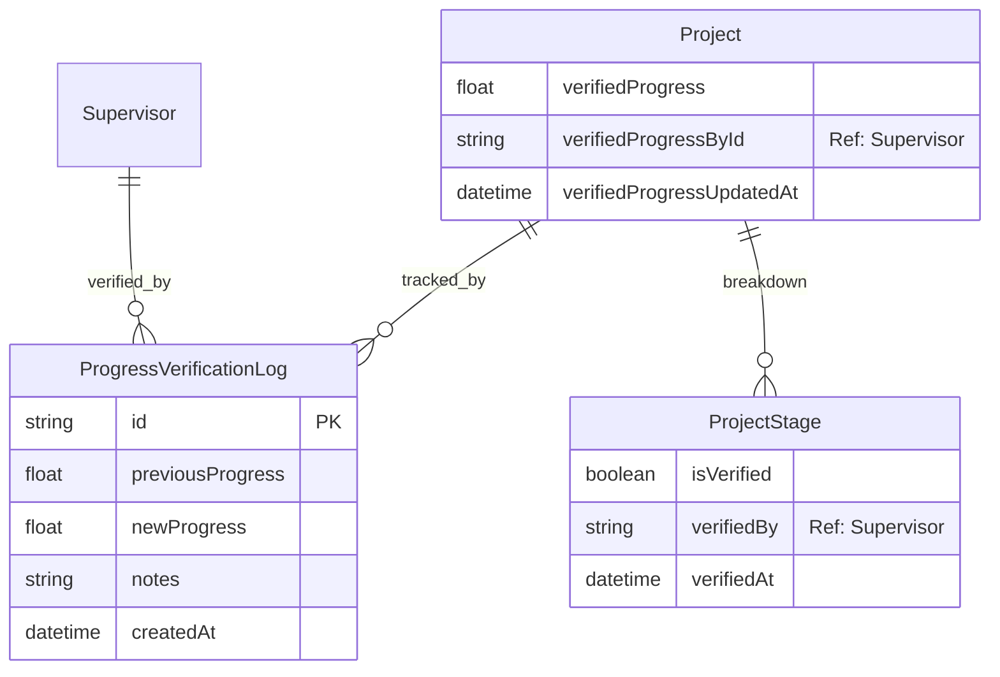

# Progress Verification ERD

Status: Draft / Generated from Prisma schema

## Tujuan
Menjelaskan sistem pencatatan progress resmi yang memiliki otoritas tertinggi dalam menentukan status penyelesaian proyek fisik.

## Diagram

## Catatan Relasi
- **ProgressVerificationLog** menyimpan histori setiap perubahan progress resmi secara formal.
- **verifiedProgressById** (tabel Project) dan **verifiedBy** (tabel ProjectStage) adalah **Reference Fields** (String ID), bukan formal foreign key di level Prisma, namun secara fungsional merujuk ke data master Supervisor.
- **ProjectStage** memiliki flag `isVerified` untuk menandai tahapan yang sudah selesai diaudit secara teknis.
