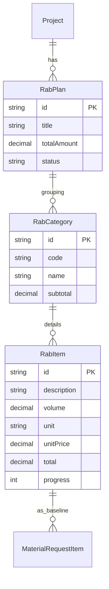

# RAB (Rencana Anggaran Biaya) ERD

Status: Draft / Generated from Prisma schema

## Tujuan
Menjelaskan hierarki data dalam penyusunan anggaran proyek, mulai dari rencana induk hingga detail item pekerjaan.

## Diagram

## Catatan Relasi
- **RabItem** menyimpan `unitPrice` dan `total` yang menjadi baseline biaya.
- **RabCategory** berfungsi untuk mengelompokkan item (misal: "Pekerjaan Persiapan", "Pekerjaan Atap").
- Item di RAB menjadi referensi utama saat melakukan permintaan material untuk memastikan penggunaan material tidak melebihi estimasi awal.
