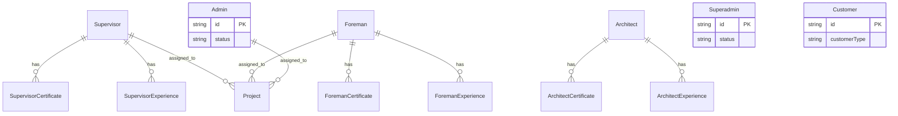

# Role Master ERD

Status: Draft / Generated from Prisma schema

## Tujuan
Menjelaskan struktur data untuk setiap persona/aktor dalam sistem beserta data pendukungnya (sertifikat & pengalaman).

## Diagram

## Catatan Relasi
- Setiap role profesional (Supervisor, Foreman, Architect) memiliki tabel pengalaman dan sertifikat untuk validasi kapasitas oleh Admin/Superadmin.
- Relasi ke **Project** menunjukkan penugasan aktif aktor tersebut pada proyek tertentu.
- **Superadmin** mengelola seluruh data master ini secara global.
