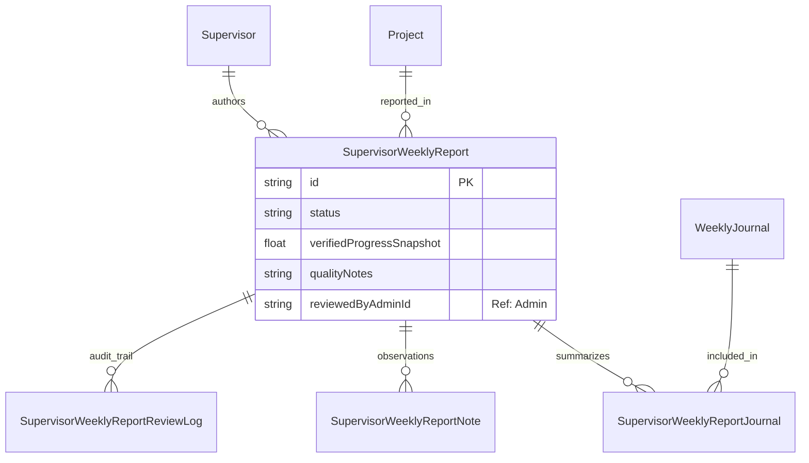

# Supervisor Weekly Report ERD

Status: Draft / Generated from Prisma schema

## Tujuan
Menjelaskan bagaimana Laporan Mingguan Pengawas merangkum data operasional dari Jurnal Mandor dan memberikan evaluasi manajerial.

## Diagram

## Catatan Relasi
- **SupervisorWeeklyReport** adalah entitas evaluasi. Statusnya menunjukkan apakah laporan sudah disetujui Admin atau belum.
- **reviewedByAdminId** adalah **Reference Field** (String ID) yang mencatat Admin pemeriksa laporan.
- **SupervisorWeeklyReportJournal** adalah tabel perantara (*junction table*) yang menghubungkan satu laporan dengan beberapa jurnal mandor dalam minggu tersebut.
- **SupervisorWeeklyReportNote** digunakan untuk mencatat temuan spesifik di lapangan (Quality, Safety, Blocker).
- **verifiedProgressSnapshot** menyimpan angka progress resmi terakhir saat laporan dibuat sebagai referensi pembaca.
