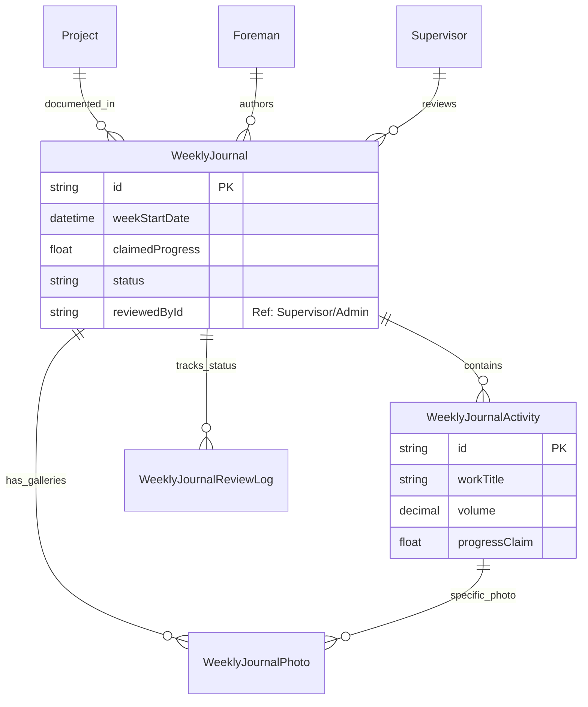

# Weekly Journal ERD

Status: Draft / Generated from Prisma schema

## Tujuan
Menjelaskan relasi antara jurnal harian/mingguan yang dibuat oleh Mandor, aktivitas pekerjaan detail, dan bukti dokumentasi foto.

## Diagram

## Catatan Relasi
- **WeeklyJournal** mencakup satu periode minggu pengerjaan.
- **reviewedById** adalah **Reference Field** (String ID) yang mencatat siapa yang melakukan review jurnal tersebut.
- **WeeklyJournalActivity** merujuk pada item pekerjaan spesifik. Secara opsional dapat merujuk ke `rabItemId` atau `projectStageId`.
- **WeeklyJournalPhoto** dapat terikat ke Jurnal secara umum atau ke Aktivitas spesifik.
- **WeeklyJournalReviewLog** menyimpan histori interaksi antara Mandor dan Pengawas (misal: "Catatan revisi pengawas").
